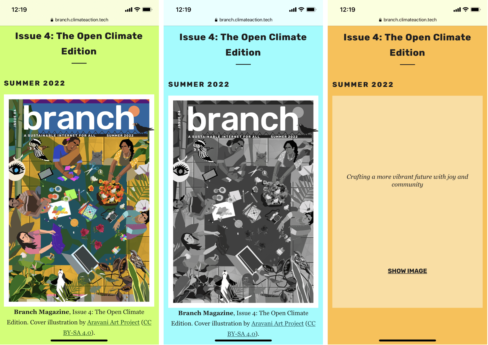

While advocating for a greener web, I often revisit the concept of a "demand-responsive" design. What would the internet look like if it became common practice to design digital products that adjusted to energy demand?

I first came across the concept of demand-responsive design in a  <a href="https://tomjarrett.earth/Branch-Magazine" target="_blank">blog post</a> by Tom Jarrett, a web designer for  <a href="https://branch.climateaction.tech/" target="_blank">Branch magazine</a>. In his post, Jarrett explains the concept of designing applications and digital products that "adapt to and reflect the physical infrastructure of the Internet and the energy behind it."

The concept of demand-responsive design builds off of the concept of responsive design, which is an approach to application development that builds apps that dynamically adjust to different screen sizes and device orientations. Responsive design has also grown to include network connectivity, which refers to applications responding to various network connections and latency.

Demand-responsive design takes responsive design to the next level by building applications that adapt to grid demand.

<b>What is grid demand?</b>

The demand for electricity is in a constant state of flux. When demand is low, meaning less electricity is being used, suppliers need to adjust by generating less electrical energy. On the flip side, when grid demand is high, suppliers need to compensate for the increased demand by generating more electrical energy.

<b>What is carbon intensity?</b>

Carbon intensity describes how clean electricity is. Specifically, it's a measurement of the amount of greenhouse gases it takes to make one unit of electricity. Carbon intensity is measured in grams of CO2 per kW/hour of electricity. 

Carbon intensity varies throughout different times of the day as well as throughout the year, depending on how many renewables are added to the supply. Unfortunately, you can't turn the wind or sun up when grid demand is high. Therefore, to manage the intermittent nature of renewable sources, a source for baseload generation is required. In many cases, this baseload generation comes from fossil fuels. Peak power demand is often satisfied by sources that can be easily stopped and started, such as burning fossil fuels. (Shoutout to <a href="https://medium.com/@margarita.rojkova" target="_blank">Margarita Rojkova</a> for helping me understand baseload generation)

Above is a real-world example of a user interface that responds to different grid intensities using a grid intensity API and the user's location. As you can see in the example, as the carbon intensity of the electrical grid changes, so does Branch magazine's design. 

At low carbon intensity, the grid demand is lower, which means there are higher outputs from renewable energy sources. At low intensity, the full magazine cover is shown, as well as other media content such as videos.

At medium intensity, there are fewer outputs from renewables, so the cover image and any other media are displayed in a lower resolution. 
Finally, when grid demand is high and carbon intensity is high, images and other media are not automatically shown. Instead, the user is provided with the alt text and the option to click to reveal. 

Building green applications doesn't solely rely on developers - every role in the development process of an application, from architects and developers to designers and testers, are responsible for limiting a product's impact on the planet. As we move toward shaping a world that is more environmentally conscious, we must shift the way we approach new technologies. In reshaping our traditional ways of approaching responsive design, we can build an Internet that adapts to the hurdles faced by climate change, including grid demand and carbon intensity.